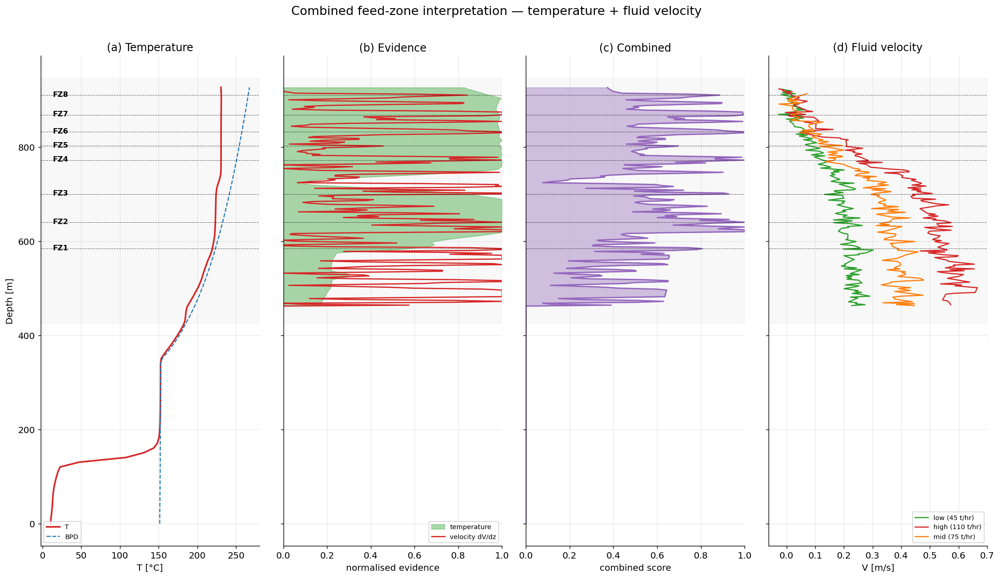

# Geothermal Well Test Analysis

A small, dependency-light Python toolkit for **geothermal completion-test interpretation**:
temperature profiling, spinner (fluid-velocity) analysis, and feed-zone detection.

It rebuilds and extends the Software Underground *Transform 2021* tutorial by
**Irene Wallis** and **Katie McLean** into an installable package with a command-line
pipeline, a worked-example notebook, and a test suite.

---

## What it does

Given a downhole **pressure–temperature profile** logged after the well has been heating
(recovering toward its natural state), the toolkit:

1. **Models the temperature profile** — computes the boiling-point-for-depth (BPD) curve from a
   dependency-free IAPWS-IF97 steam table, the smoothed gradient and curvature, a
   conductive-vs-convective classification, and a temperature-based feed-zone score.
2. **Models the fluid velocity** — inverts spinner (PTS) logs for in-well fluid velocity using
   the tool-speed vs frequency **cross-plot method**. Where raw spinner logs are unavailable, a
   physically consistent **forward model** generates them from a feed-zone specification so the
   full workflow can be demonstrated and validated end-to-end.
3. **Locates the feed zones** — fuses the two independent datasets into a combined score and
   returns the confident feed zones, ranked by strength with their relative injectivity.

<p align="center">
  
</p>

---

## Background — the science in brief

Geothermal wells have long perforated intervals (often > 1 km) that connect the wellbore to the
reservoir through discrete permeable **feed zones**. Locating them and estimating how much each
one flows is the core deliverable of a completion test.

- **Temperature.** A stabilised heating profile is the single most diagnostic log. Impermeable
  rock conducts heat, giving a steep, roughly linear gradient. Permeable, fluid-charged intervals
  convect, homogenising temperature toward a **near-isothermal** profile that tracks the boiling
  point for depth. Feed zones therefore appear as gradient breaks and isothermal intervals.
- **Fluid velocity (spinner).** A PTS tool's impeller reads the *relative* velocity between fluid
  and tool. During an injection test, fluid leaves the well at each feed zone, so the in-well
  velocity **steps down** with depth; the size of each step is proportional to the mass that zone
  accepts. Cross-plotting tool speed against spinner frequency over several passes recovers the
  fluid velocity as the fit's y-intercept.

Combining the two — feed zones supported by *both* an isothermal temperature signature and a
velocity step — is far more robust than either dataset alone.

See [`docs/METHODOLOGY.md`](docs/METHODOLOGY.md) for the equations and modelling choices.

---

## Repository layout

```
geothermal-well-test-analysis/
├── README.md
├── LICENSE                     # MIT
├── pyproject.toml              # installable package + console script
├── requirements.txt            # runtime dependencies
├── requirements-dev.txt        # + jupyter, pytest
├── data/
│   └── Data-Temp-Heating37days.csv    # example 37-day heating profile
├── src/geothermal_welltest/    # the package
│   ├── config.py               # well geometry + analysis parameters
│   ├── steam_tables.py         # IAPWS-IF97 saturation temperature
│   ├── io_utils.py             # load + QC the profile
│   ├── temperature.py          # gradient, curvature, regime, feed-zone score
│   ├── spinner.py              # PTS forward model + cross-plot inversion
│   ├── feedzones.py            # combine evidence, detect + rank zones
│   ├── plotting.py             # publication figures
│   └── cli.py                  # end-to-end pipeline (console entry point)
├── scripts/
│   └── run_analysis.py         # run the pipeline from a source checkout
├── notebooks/
│   └── Geothermal_Well_Test_Worked_Example.ipynb
├── tests/                      # unittest / pytest suite
└── figures/                    # example outputs (regenerated by the pipeline)
```

---

## Installation

Python 3.9+ is required. From the repository root:

```bash
# option A — install the package (recommended)
python -m pip install -e .

# option B — just the runtime dependencies, run from source
python -m pip install -r requirements.txt
```

For the notebook and tests:

```bash
python -m pip install -r requirements-dev.txt
```

The only scientific dependencies are **numpy, pandas, scipy, matplotlib**. There is no `iapws`
dependency — the steam table is implemented directly.

---

## Quickstart

### 1. Command line

```bash
# after `pip install -e .`
welltest-analyze --data data/Data-Temp-Heating37days.csv --outdir figures

# or, without installing:
python scripts/run_analysis.py --outdir figures
```

This writes five figures and a ranked `feed_zones.csv` to `figures/` and prints a summary:

```
[data] 94 points, 0-926 m, Tmax 230.8 °C at 901 m
[temperature] feed-zone picks: 654 m, 762 m
[velocity] high (110 t/hr): 232 intervals -> 149 after QC
[feed zones] confident picks: 584 m, 640 m, 700 m, 772 m, 802 m, 832 m, 868 m, 910 m
```

### 2. As a library

```python
from geothermal_welltest import (
    load_profile, run_temperature_analysis,
    build_synthetic_pts, run_velocity_analysis, combine_and_detect,
)

df = load_profile("data/Data-Temp-Heating37days.csv")
temp = run_temperature_analysis(df)

feedzones = [(560, 600, 0.10), (748, 775, 0.24), (800, 835, 0.28)]   # (top, bottom, injectivity)
pts, _ = build_synthetic_pts(pump_tph=110, feedzones=feedzones, profile=df)
velocity = run_velocity_analysis({"high": pts})

result = combine_and_detect(temp.grad, velocity, feedzones)
print(result.table)      # ranked feed zones with evidence + relative injectivity
```

### 3. Notebook

Open [`notebooks/Geothermal_Well_Test_Worked_Example.ipynb`](notebooks/Geothermal_Well_Test_Worked_Example.ipynb)
for a narrated walkthrough that reproduces every figure.

---

## Using your own data

The temperature workflow runs directly on any CSV with columns
`depth_m, whp_barg, pres_barg, temp_degC`.

For the fluid-velocity workflow with **real spinner logs**, skip `build_synthetic_pts` and pass
your PTS data — a long-form dataframe with one row per logging pass per depth and columns
`depth_m, speed_mps, frequency_hz, pressure_bara` — straight into `run_velocity_analysis`.
Everything downstream (QC, `dV/dz`, combination, detection) is unchanged. Update the well
completion in `WellGeometry` (`config.py`) to match your well.

---

## Testing

```bash
python -m pytest            # if pytest is installed
python -m unittest discover -s tests    # stdlib fallback, no extra deps
```

The suite validates the steam table against IAPWS reference points, checks that the cross-plot
inversion recovers the forward-modelled velocity, and confirms feed-zone detection lands on the
modelled zones.

---

## Results on the example well

The bundled 37-day heating profile (926 m deep, up to 231 °C) yields a conductive cap to ~450 m
over a broad convective production interval. The combined detector locates eight feed zones; the
two strongest by velocity step (relative injectivity ≈ 0.30 each) sit at ~800–835 m and
~748–775 m — the intervals to target for production.

| Figure | Content |
|---|---|
| `01_temperature_dashboard.png` | T + BPD, gradient, below-boiling, temperature feed-zone score |
| `02_crossplot_example.png` | The cross-plot inversion on one interval |
| `03_velocity_qc.png` | Raw inversion (R²) and cleaned velocity vs ground truth |
| `04_feedzone_signal.png` | Velocity and its `dV/dz` feed-zone signal per pump rate |
| `05_combined_interpretation.png` | Integrated temperature + velocity feed-zone interpretation |

---

## References

- Zarrouk, S.J. & McLean, K. (2019). *Geothermal Well Test Analysis: Fundamentals, Applications
  and Advanced Techniques*. Academic Press.
- Grant, M.A. & Bixley, P.F. (2011). *Geothermal Reservoir Engineering* (2nd ed.). Academic Press.
- Kaya, E., Zarrouk, S.J. & O'Sullivan, M.J. (2011). Reinjection in geothermal fields.
  *Renewable and Sustainable Energy Reviews*, 15(1).
- Wagner, W. et al. (2000). The IAPWS Industrial Formulation 1997 for the Thermodynamic
  Properties of Water and Steam. *J. Eng. Gas Turbines Power*, 122.
- Wallis, I. & McLean, K. (2021). *Well Test Analysis Tutorial*, Software Underground Transform 2021.

---

## License & acknowledgements

Released under the [MIT License](LICENSE).

This project builds on the open teaching material of the Software Underground *Transform 2021*
Well Test Analysis tutorial by Irene Wallis and Katie McLean; please cite their work when using
this analysis.
